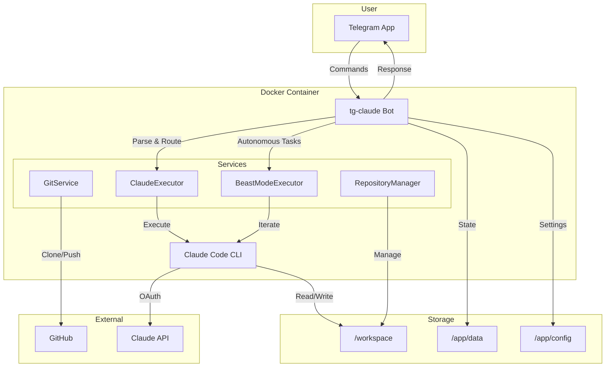

# tg-claude: Telegram Client for Claude Code


Control Claude Code remotely via Telegram with your Claude subscription.

**[Demo Video](https://x.com/uncanny_guzus/status/2006073533252919361)**

## How It Works



## Pre-requisites

- **Claude subscription**: Active Claude Pro/Team subscription
- **Docker**: For deployment

## Setup

### 1. Get Claude OAuth Token

Login to Claude and generate an OAuth token for headless environments:

```bash
# Install Claude CLI locally first
curl -fsSL https://claude.ai/install.sh | bash

# Login with your Claude subscription
claude login

# Generate OAuth token for server use
claude setup-token
```

Copy the generated `CLAUDE_CODE_OAUTH_TOKEN` value.

### 2. Configure Environment

Create a `.env` file on your server:

```env
TELEGRAM_BOT_TOKEN=your_bot_token      # From @BotFather
ALLOWED_USER_IDS=123456789             # Your Telegram ID (@userinfobot)
CLAUDE_CODE_OAUTH_TOKEN=your_token     # From claude setup-token
GITHUB_TOKEN=ghp_xxx                   # Optional, for private repos
```

### 3. Deploy

```bash
docker compose up -d
```

## Commands

| Command | Description |
|---------|-------------|
| `/task <description>` | Execute a coding task with Claude AI |
| `/beast <task>` | Autonomous mode (iterates until complete) |
| `/repo` | Manage repositories (clone/new/list/switch) |
| `/remote` | Manage git remote (show/set/test) |
| `/bot` | Manage bots via Mothership |
| `/status` | Check active tasks |
| `/config` | User configuration |
| `/mcp` | Manage MCP servers per repository |
| `/help` | Show help |

Plain text messages are treated as `/task` commands.

## User Configuration

### Tech Stack Preferences

Set your preferred package managers:

```
/config techstack typescript bun    # Options: bun, npm, pnpm, yarn
/config techstack python uv         # Options: uv, pip, poetry, pipenv
```

These preferences are synced to `.claude/settings.json` in each repository.

### MCP Servers

Configure Model Context Protocol servers per repository:

```
/mcp add <name> <command> [args...]  # Add MCP server
/mcp remove <name>                   # Remove MCP server
/mcp list                            # List configured servers
/mcp clear                           # Remove all servers
```

MCP configs are stored in `.mcp.json` at the repository root.

### CLAUDE.md Template

Set a custom template for new repositories:

```
/config claudemd show    # View current template
/config claudemd set     # Set new template (send content after)
/config claudemd reset   # Reset to default
```

## Development

```bash
bun install
bun dev
```

### Build Locally

```bash
docker compose build
docker compose up -d
```

## Security

- User whitelist via `ALLOWED_USER_IDS`
- Rate limiting per user
- Uses `--dangerously-skip-permissions` - run only with trusted users

---

MIT License
