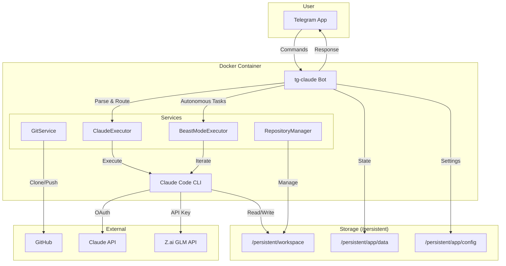

# tg-claude: Telegram Client for Claude Code


Control Claude Code remotely via Telegram with your Claude subscription.

**[Demo Video](https://x.com/uncanny_guzus/status/2006073533252919361)**

## How It Works



## Quick Start

📖 **[Full Deployment Guide](./docs/DEPLOYMENT.md)** - Complete step-by-step tutorial

### Deploy on Railway (Easiest)

[](https://railway.com/deploy/hEF-Y8?referralCode=56ZSuE)

> 💰 **Cost**: Claude / GLM (Z.ai) subscription + Railway hosting (~$5/mo)

1. Click the button above
2. Set required environment variables:
   - `TELEGRAM_BOT_TOKEN` - from [@BotFather](https://t.me/BotFather)
   - `ALLOWED_USER_IDS` - your Telegram ID (get from [@userinfobot](https://t.me/userinfobot))
   - `CLAUDE_CODE_OAUTH_TOKEN` - from `claude setup-token`
3. Deploy!

### Deploy on VPS (Docker Compose)

```bash
git clone https://github.com/guzus/tg-claude.git
cd tg-claude
cp .env.example .env  # Edit with your tokens
docker compose up -d
```

Data is stored in `./persistent/` on your host.

## Commands

| Command | Description |
|---------|-------------|
| `/beast <task>` | Autonomous mode (iterates until complete) |
| `/repo` | Manage repositories (clone/new/list/switch) |
| `/remote` | Manage git remote (show/set/test) |
| `/bot` | Manage bots via Mothership (in development) |
| `/status` | Check active tasks |
| `/config` | User configuration |
| `/mcp` | Manage MCP servers per repository |
| `/help` | Show help |

Just send a plain text message to execute tasks with Claude.

## Configuration

### Using GLM Instead of Claude

You can use [GLM-4](https://docs.z.ai/devpack/tool/claude) as an alternative AI provider:

```
/config set aiProvider.provider glm
/config set aiProvider.apiKey YOUR_ZAI_API_KEY
```

Get your API key from [Z.ai](https://z.ai/manage-apikey/apikey-list). See the [Deployment Guide](./docs/DEPLOYMENT.md#using-glm-instead-of-claude-optional) for details.

### Other Settings

```bash
# Tech stack preferences
/config techstack typescript bun    # bun, npm, pnpm, yarn
/config techstack python uv         # uv, pip, poetry, pipenv

# MCP servers (per repository)
/mcp add <name> <command> [args...]
/mcp list

# CLAUDE.md template
/config claudemd show
```

## Development

```bash
bun install
bun dev
```

### Build Locally

```bash
docker compose build
docker compose up -d
```

## Security

- User whitelist via `ALLOWED_USER_IDS`
- Rate limiting per user
- Uses `--dangerously-skip-permissions` - run only with trusted users

---

MIT License
