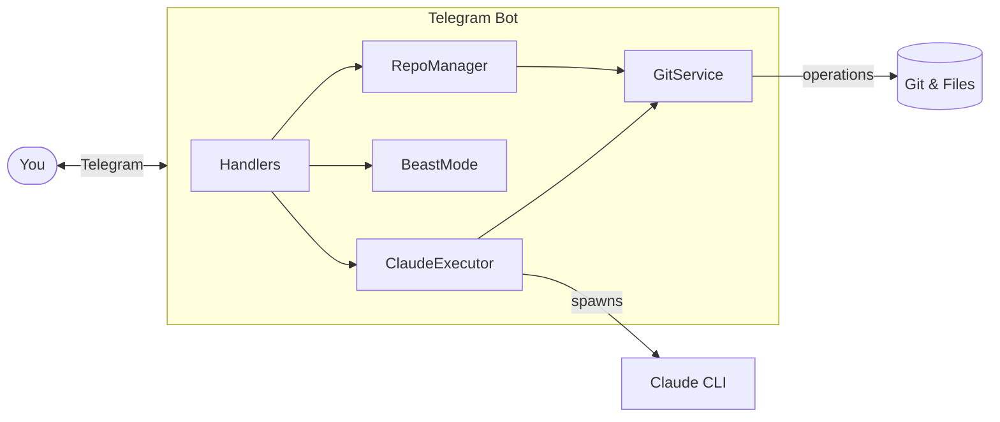

# tg-claude: Telegram Client for Claude Code

Control Claude Code remotely via Telegram with your Claude subscription.

## Pre-requisites

- **Claude CLI with active subscription**: Login to Claude on your remote server first:
  ```bash
  claude login
  ```

## Quick Start

```bash
# Install dependencies
bun install

# Build and run
bun run build && bun start

# Development
bun dev
```

### Environment

Copy `.env.example` to `.env` and configure:

```env
TELEGRAM_BOT_TOKEN=your_bot_token      # From @BotFather
ALLOWED_USER_IDS=123456789             # Your Telegram ID
WORKSPACE_PATH=/path/to/projects
GITHUB_TOKEN=ghp_xxx                   # Optional, for private repos
```

## Commands

| Command | Description |
|---------|-------------|
| `/task <description>` | Execute a coding task with Claude AI |
| `/beast <task>` | Autonomous mode (iterates until complete) |
| `/repo` | Manage repositories (clone/new/list/switch) |
| `/remote` | Manage git remote (show/set/test) |
| `/bot` | Manage bots via Mothership |
| `/status` | Check active tasks |
| `/config` | User configuration |
| `/help` | Show help |

Plain text messages are treated as `/task` commands.

## Architecture

```
src/
├── handlers/           # Telegram command handlers
│   ├── BaseHandler     # Common utilities & auth
│   ├── TaskHandlers    # /task command
│   ├── RepoHandlers    # /repo command
│   └── CallbackQuery   # Inline keyboard actions
├── services/           # Business logic
│   ├── ClaudeExecutor  # Claude CLI process management
│   ├── GitService      # Git operations (commit, push, clone)
│   ├── RepoManager     # Repository discovery & switching
│   ├── StateManager    # Centralized in-memory state
│   └── BeastMode       # Autonomous iteration mode
├── config/             # Configuration management
├── types/              # TypeScript definitions
└── utils/              # Logging, UI helpers
```



## Security

- User whitelist via `ALLOWED_USER_IDS`
- Rate limiting per user
- Uses `--dangerously-skip-permissions` - run only with trusted users

---

MIT License
