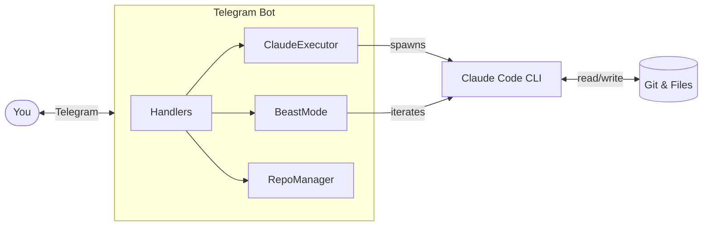

# Claude Code Telegram Bot

Control Claude Code remotely via Telegram with your Claude subscription.

## Quick Start

```bash
# Install and run
uv sync
uv run python -m src  # or: npm install && npm run build && npm start
```

### Required Environment

```env
TELEGRAM_BOT_TOKEN=your_bot_token      # From @BotFather
CLAUDE_API_KEY=your_claude_api_key     # From console.anthropic.com
ALLOWED_USER_IDS=123456789             # Your Telegram ID (from @userinfobot)
WORKSPACE_PATH=/path/to/projects
GITHUB_TOKEN=ghp_xxx                   # Optional, for private repos
```

## Commands

| Command | Description |
|---------|-------------|
| `/start` | Welcome and help |
| `/task <description>` | Execute a coding task |
| `/beast <task>` | Autonomous AI mode (iterates until complete) |
| `/repo` | Manage repositories (clone/new/list/switch) |
| `/remote` | Manage git remote (show/set/test/remove) |
| `/bot` | Manage bots via Mothership |
| `/status` | Check active tasks |
| `/config` | User configuration |
| `/check` | Verify Claude CLI setup |

Plain text messages are treated as `/task` commands.

## Architecture



## Deployment

```bash
# PM2
pm2 start dist/index.js --name claude-bot

# Health check
curl localhost:3000/health
```

## Security

- User whitelist via `ALLOWED_USER_IDS`
- Rate limiting (20/hour, 100/day)
- Uses `--dangerously-skip-permission` - run only with trusted users

---

MIT License
