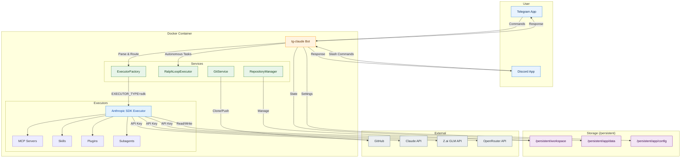

<p align="center">
  
</p>

<h1 align="center">tg-claude</h1>

<p align="center">
  Control Claude Code remotely via Telegram or Discord with your Claude subscription.
</p>

<p align="center">
  
  
  
  
  
</p>

<p align="center">
  <a href="https://x.com/uncanny_guzus/status/2006073533252919361"><strong>Demo Video</strong></a>
</p>

## How It Works



## Executor Modes

tg-claude supports two execution modes:

| Mode | Description | Best For |
|------|-------------|----------|
| **SDK** (default) | Uses [@anthropic-ai/claude-agent-sdk](https://github.com/anthropics/claude-agent-sdk-demos) directly | Direct API access, simpler setup |
| **CLI** (deprecated) | Uses Claude Code CLI with full tool support | Not maintained |

Set via `EXECUTOR_TYPE` environment variable:
- `EXECUTOR_TYPE=sdk` - Anthropic SDK (default, recommended)
- `EXECUTOR_TYPE=cli` - Claude Code CLI (deprecated, not maintained)

### Authentication

**For SDK mode**, set ONE of:
- `CLAUDE_CODE_OAUTH_TOKEN` - Uses your Claude subscription (run `claude setup-token` to get it)
- `ANTHROPIC_API_KEY` - Uses API key billing from [Anthropic Console](https://console.anthropic.com/)

> **Important**: Do NOT set both. If `ANTHROPIC_API_KEY` is set alongside OAuth token, it may cause billing conflicts.

**For CLI mode in Docker** (deprecated): Create `~/.claude.json` with `{"hasCompletedOnboarding": true}` to bypass interactive prompts.

### SDK Executor Tools

The SDK executor includes built-in tools:
- `read_file`, `write_file`, `edit_file` - File operations
- `bash` - Command execution
- `glob`, `grep` - File search
- `list_directory` - Directory listing

## Quick Start

📖 **[Full Deployment Guide](./docs/DEPLOYMENT.md)** - Complete step-by-step tutorial

📖 **[Discord Integration Guide](./docs/DISCORD.md)** - Set up the Discord client

### Deploy on Railway (Easiest)

[](https://railway.com/deploy/hEF-Y8?referralCode=56ZSuE)

> 💰 **Cost**: Anthropic API credits or Claude subscription + Railway hosting (~$5/mo)

1. Click the button above
2. Set required environment variables:
   - `TELEGRAM_BOT_TOKEN` - from [@BotFather](https://t.me/BotFather)
   - `ALLOWED_USER_IDS` - your Telegram ID (get from [@userinfobot](https://t.me/userinfobot))
   - `CLAUDE_CODE_OAUTH_TOKEN` - from `claude setup-token` (uses your Claude subscription)
   - Or `ANTHROPIC_API_KEY` - from [Anthropic Console](https://console.anthropic.com/) (uses API billing)
3. Deploy!

### Deploy on VPS (Docker Compose)

```bash
git clone https://github.com/guzus/tg-claude.git
cd tg-claude
cp .env.example .env  # Edit with your tokens
docker compose up -d
```

Data is stored in `./persistent/` on your host (and is **gitignored**).

## Commands

| Command | Description |
|---------|-------------|
| `/ralph <task>` | Autonomous loop mode (via `ralph-loop` Claude plugin) |
| `/repo` | Manage repositories (clone/new/list/switch) |
| `/scan` | Scan for existing repositories |
| `/remote` | Manage git remote (show/set/test) |
| `/bot` | Manage bots via Mothership (in development) |
| `/status` | Check active tasks |
| `/cancel <id>` | Cancel a running task |
| `/limits` | Check your rate limits |
| `/config` | User configuration |
| `/ai` | Toggle AI provider (Claude/GLM/OpenRouter) |
| `/mcp` | Manage MCP servers per repository |
| `/plugin` | Manage Claude plugins (including `ralph-loop`) |
| `/help` | Show help |

Just send a plain text message to execute tasks with Claude.

> Note: `/bot` (Mothership) commands are optional and require the Mothership CLI + Nomad. If you don't need bot deployment, you can ignore them.

## Configuration

### Using GLM Instead of Claude

You can use [GLM-4](https://docs.z.ai/devpack/tool/claude) as an alternative AI provider:

```
/config set aiProvider.provider glm
/config set aiProvider.glmApiKey YOUR_ZAI_API_KEY
```

Get your API key from [Z.ai](https://z.ai/manage-apikey/apikey-list). See the [Deployment Guide](./docs/DEPLOYMENT.md#using-glm-instead-of-claude-optional) for details.

### Using OpenRouter

[OpenRouter](https://openrouter.ai) provides access to 100+ models from multiple providers through a unified API:

```
/config set aiProvider.provider openrouter
/config set aiProvider.openrouterApiKey YOUR_OPENROUTER_API_KEY
```

Tip: use `/ai` and tap **Set OpenRouter Key** to paste your key interactively.

Get your API key from [OpenRouter](https://openrouter.ai/settings/keys).

**Custom Models**: By default, OpenRouter uses [Minimax](https://openrouter.ai/minimax/minimax-m2.1) for all model slots. You can customize each slot independently:

```
/config set aiProvider.haikuModel openai/gpt-5.2
/config set aiProvider.sonnetModel anthropic/claude-sonnet-4.5
/config set aiProvider.opusModel anthropic/claude-opus-4.5
```

Browse available models at [OpenRouter Models](https://openrouter.ai/models).

**Quick Switch**: Use `/ai` to toggle between Claude, GLM, and OpenRouter with inline buttons.

### Other Settings

```bash
# Tech stack preferences
/config techstack typescript bun    # bun, npm, pnpm, yarn
/config techstack python uv         # uv, pip, poetry, pipenv

# MCP servers (per repository)
/mcp add <name> <command> [args...]
/mcp list

# CLAUDE.md template
/config claudemd show
```

## Development

```bash
bun install
bun dev
```

### Build Locally

```bash
docker compose build
docker compose up -d
```

## Security

- User whitelist via `ALLOWED_USER_IDS`
- Rate limiting per user
- Uses `--dangerously-skip-permissions` - run only with trusted users

---

MIT License
